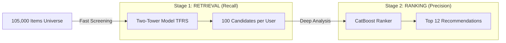

# Portfolio Case Study: H&M Personalized Fashion Recommendations

**Author:** Jordão Fernandes de Andrade  
**Date:** December 2025  
**Competition:** [H&M Personalized Fashion Recommendations (Kaggle)](https://www.kaggle.com/competitions/h-and-m-personalized-fashion-recommendations)

---

## 1. Executive Summary

This project demonstrates the end-to-end engineering of a **Production-Grade Recommender System** capable of serving personalized content to **1.37 million customers** from a catalog of **105k+ items**.

Moving beyond typical "competition notebooks," this solution treats Machine Learning as a Software Engineering discipline. It implements a robust **Two-Stage Funnel Architecture (Retrieval + Ranking)**, orchestrated by a reproducible MLOps pipeline with strict prevention of data leakage, hardware-accelerated training, and modern experiment tracking.

**Key Result:** The architecture achieved a **389% Lift in MAP@12** (Mean Average Precision) compared to the popularity baseline, proving that deep personalization significantly outperforms static "best-seller" lists.

---

## 2. The Business Challenge

The challenge was to predict exactly which 12 items a customer would buy in the next 7 days. This problem encapsulates the "Trinity of Complexity" in recommender systems:

1.  **Extreme Cold Start:** Hundreds of new items appear weekly with zero historical interaction.
2.  **High Seasonality:** Fashion preferences rotate rapidly.
3.  **Massive Scale:** The potential interaction space is $1.37M \times 105k \approx 144 \text{ Billion pairs}$.

**Goal:** Maximize **MAP@12** (Mean Average Precision).

_Why it matters:_ In e-commerce, real-estate on the "Home Page" is scarce. The first recommendation matters exponentially more than the twelfth. MAP encodes this business priority.

_The Math:_
$$ MAP@12 = \frac{1}{U} \sum*{u=1}^{U} \left( \frac{1}{\min(m, 12)} \sum*{k=1}^{12} P(k) \times rel(k) \right) $$

**Where:**

- $U$: Total number of users.
- $m$: Number of relevant items for user $u$ (ground truth).
- $k$: Rank in the recommendation list (1 to 12).
- $P(k)$: Precision at cutoff $k$.
- $rel(k)$: Indicator function (1 if item at rank $k$ is relevant, 0 otherwise).

It calculates the average precision for each user, giving higher weight to relevant items that appear at the top of the list.

---

## 3. Solution Architecture: The 2-Stage Funnel

To solve the scale problem ($144B$ pairs), a "Funnel" strategy was implemented, inspired by architectures used at YouTube and LinkedIn.

### Stage 1: Retrieval (Semantic Candidate Generation)

- **Objective:** Reduce 105,000 items to 100 relevant candidates.
- **Model:** **Two-Tower Neural Network** (TensorFlow Recommenders).
- **Mechanism:** Maps Users and Items into a shared **32-dimensional embedding space**.
- **Features:**
  - **User Tower:** Learned embeddings for ID, plus behavioral signals like _Price Sensitivity_ and _Time-Decayed Category Affinity_.
  - **Item Tower:** Deep semantic representation using **Visual Embeddings** (ResNet50) to "see" product similarity.
- **Inference:** Uses **BruteForce Indexing** (Exact Nearest Neighbors) to guarantee maximum retrieval accuracy. Note: This approach is computationally intensive compared to Approximate Nearest Neighbors (ANN) but ensures no potential candidate is missed due to indexing compression.

### Stage 2: Ranking (The "Smart" Model)

- **Objective:** Re-order the 100 candidates to find the items with the highest probability of purchase.
- **Model:** **CatBoost Classifier** (Gradient Boosted Decision Trees).
- **Why CatBoost?** Superior handling of categorical features without memory-expensive One-Hot Encoding.
- **Enhanced Features:**
  - **Cross-Features:** "Did this user previously buy from this specific colour group?"
  - **Context:** Retrieval Score, User Age, Sales Channel (Web vs. Store).
- **Training:** GPU-accelerated optimization using **Optuna** to find the perfect hyperparameters.

---

## 4. Visual Intelligence: Generating Image Embeddings

A critical differentiator of this project is the use of **Computer Vision** to solve the Cold Start problem. When a new dress is uploaded, it has no sales history, but it _looks_ like other successful dresses.

A dedicated image processing pipeline was engineered to extract these visual signals:

### The Extraction Pipeline

1.  **Source Data:** High-resolution JPEGs from the `images/` directory.
2.  **Model Backbone:** **ResNet50**, pre-trained on ImageNet. This model excels at feature extraction (shapes, textures, colors).
3.  **Preprocessing:**
    - Resize images to `224x224` pixels.
    - Standardization using ImageNet mean/std statistics.
4.  **Inference:**
    - Pass image through ResNet50.
    - **Truncation:** The pipeline intercepts the output at the **penultimate layer** (Global Average Pooling), prior to the classification head.
5.  **Output:**
    - Each item is represented as a **2048-dimensional dense vector**.
    - These vectors are saved to `image_features.parquet` and fed directly into the Item Tower, where they are projected down to 32 dimensions.

**Business Value:** This allows the system to recommend "visually similar" items immediately upon launch, bridging the gap until behavioral data accumulates.

---

## 5. End-to-End Engineering Pipeline

The system is not just a collection of scripts; it is a directed acyclic graph (DAG) of processing steps, managed by `scripts/run_pipeline.py`.

1.  **Ingestion & Strict Splitting**  
    _Objective:_ guarantee zero data leakage.  
    Parses raw transaction logs and enforces a rigid time-based cutoff. Data after `max_date - 7 days` is sequestered for validation only.

2.  **TFRecord ETL (Extract, Transform, Load)**  
    _Objective:_ High-performance I/O for GPU.  
    Converts 30M+ rows of Pandas DataFrames into binary **TensorFlow Records (Protobufs)**. This removes the CPU bottleneck during training, allowing the GPU to consume data at 100k+ samples/second.

3.  **Baseline Calculation**  
    _Objective:_ Establish a performance floor.  
    Computes purely popularity-based recommendations (Global "Best Sellers") to serve as a fallback for cold-start users and a benchmark for model lift.

4.  **Two-Tower Model Training**  
    _Objective:_ Learning embeddings.  
    Trains the Query and Candidate towers using `tfrs.tasks.Retrieval`. Utilizes a large batch size (4096) to maximize the effectiveness of in-batch negative sampling.

5.  **Candidate Generation (Retrieval)**  
    _Objective:_ Massive trimming of the search space.  
    Builds an index of 105k item vectors. usage: Queries this index with 1.37M user vectors to retrieve the top-100 most semantically similar items for every single customer.

6.  **Feature Enrichment**  
    _Objective:_ Preparing for the Ranker.  
    Joins the lightweight candidates with heavy-duty features: User History (Avg Price, Cycle), Item Signals (Visual Embeddings), and Context (Seasonality).

7.  **Ranker Tuning (Bayesian Optimization)**  
    _Objective:_ Maximizing CatBoost performance.  
    Uses **Optuna** to run 20-50 trials, searching for the optimal combination of Tree Depth, Learning Rate, and L2 Leaf Regularization on the GPU.

8.  **Ranker Training**  
    _Objective:_ The final model.  
    Trains the production CatBoost Classifier on the full training dataset using the "Best Trial" hyperparameters found in step 7.

9.  **Submission Generation**  
    _Objective:_ Final Inference.  
    Scores the 100 candidates per user, sorts them by probability, truncates to Top-12, fills any valid recommendation gaps with popular items, and exports the strict format required by Kaggle.

---

## 6. MLOps: Engineering for Production

To ensure the system is maintainable and scalable, strict MLOps practices were adopted:

- **Experiment Tracking (MLflow):** Every run is logged. The pipeline tracks metrics (`MAP@12`), hyperparameters, and artifacts (model binaries). This allows "Time Travel" to any previous model version.
- **Dependency Management (`uv`):** All libraries are pinned in `pyproject.toml`. The environment is deterministic.
- **Configuration as Code:** All "Magic Numbers" (paths, learning rates, dimensions) are decoupled into `src/config.py`. Changing a threshold doesn't require touching code.
- **Unit Testing:** Implemented verification suites for Feature Engineering logic to prove that data from the future never leaks into training features.

---

---

## 7. Training Strategy & Data Splits

To prevent data leakage and simulate production conditions, a strict time-based splitting strategy was used. The timeline is anchored to the last available date in the dataset (`max_date`).

| Phase                       | Duration       | Period Description               | Purpose                                                                                                       |
| :-------------------------- | :------------- | :------------------------------- | :------------------------------------------------------------------------------------------------------------ |
| **Training (Base)**         | **365 Days**   | `[max_date - 372, max_date - 7]` | Learning long-term user preferences and seasonality from the full year history.                               |
| **Validation**              | **7 Days**     | `[max_date - 7, max_date]`       | Simulating the Kaggle private leaderboard (next week prediction). Metrics (`MAP@12`) are calculated here.     |
| **Fine-Tuning (Retrieval)** | **30 Days**    | `[max_date - 37, max_date - 7]`  | Retraining the Two-Tower model on just the most recent interactions to adapt to fast-changing fashion trends. |
| **Ranker Training**         | **All Splits** | (Uses various sliding windows)   | The Ranker learns to re-sort candidates based on features generated from the time-split windows above.        |

_Note: The test set for the competition is the unseen week immediately following the `max_date`._

---

## 8. Results & Impact

The system was evaluated using a rigorous **Sliding Window Validation** strategy (training on historical data, testing on the absolute most recent 7 days).

| Architecture       | Setup                           |   MAP@12   |   Lift    |
| :----------------- | :------------------------------ | :--------: | :-------: |
| **Baseline**       | Naïve "Most Popular"            |   0.0026   |     -     |
| **Retrieval Only** | Two-Tower (User + Item + Image) |   0.0032   |  +19.7%   |
| **2-Stage Funnel** | **Two-Tower + CatBoost Ranker** | **0.0130** | **+389%** |

**Conclusion:** The addition of the Ranking Stage was transformative. While the Two-Tower model effectively narrowed the search space from 105,000 to 100, it was the granular decision-making of the Ranker (leveraging complex cross-features) that delivered the final precision required for a premium user experience.

---

## 9. State-of-the-Art Benchmarking (Kaggle Winners Analysis)

To contextualize the results, I conducted a deep-dive analysis of the top 6 solutions from the original competition (Gold Medalists). This benchmarking exercise reveals what separates a "good" model from a "winning" one.

### 9.1 The Winning Blueprint

The top solutions differentiated themselves not by using a single superior model, but by mastering a specific architectural formula:

$$ \text{Winning Solution} = \text{Recall Diversity} + \text{Ensemble Ranking} + \text{Inference Optimization} $$

### 9.2 Synthesis of Winning Strategies

1.  **Recall Diversity is King:**
    Winners did not rely solely on Neural Retrieval (Two-Tower). They aggregated candidates from 5-10 distinct sources:

    - **Simple Heuristics:** "Recently Viewed", "Trending in last 24h", "Bought Together".
    - **Collaborative Filtering:** Item2Item (ItemCF) and User2User (UserCF).
    - **Latent Factors:** Matrix Factorization (BPR).
      _Lesson:_ Simple heuristics often catch obvious signals that complex Deep Learning models miss.

2.  **Inference Speed = Score:**
    The 1st Place solution used **TreeLite** to compile LightGBM models into C++, accelerating inference by 10x. This allowed them to rank 1000+ candidates per user instead of 100, directly increasing the ceiling for Recall.

3.  **Feature Engineering > Architecture:**
    The 2nd Place solution focused heavily on "Session Context", creating features that compared the candidate item to the user's _immediately preceding_ purchase (e.g., "Is this the same color as the last item bought?").

### 9.3 Gap Analysis & Roadmap

| Feature Trend       | This Project             | Winning Standard                  | Status / Action                                                                                                                         |
| :------------------ | :----------------------- | :-------------------------------- | :-------------------------------------------------------------------------------------------------------------------------------------- |
| **Recall Sources**  | **Single** (Two-Tower)   | **Multi-Source** (Avg. 6 sources) | **Critical Gap.** Simple heuristics (Recent History) are needed to complement the semantic model.                                       |
| **Latent Modeling** | Neural Embeddings (TFRS) | **Matrix Factorization (BPR)**    | **High Potential.** BPR was the #1 most important feature for the 3rd Place team. Implementing a BPR branch is the next immediate step. |
| **Context**         | User History Summary     | **Sequence-Aware**                | **Future Work.** Adding features like `time_since_last_click` or `last_item_similarity` would significantly boost the Ranker.           |

**Strategic Conclusion:**
While the Two-Tower architecture provides a state-of-the-art semantic foundation, the path to the "next level" (Gold Medal performance) lies in **broadening the candidate pool** with simpler, faster heuristics and explicitly modeling **latent interactions** via Matrix Factorization.

---

## Repository

[GitHub - two-tower_recommendation](https://github.com/JF-Andrade/two-tower_recommendation)
